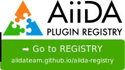

# AiiDA plugin registry

This repository contains the **source** of the official registry of AiiDA plugins.

<p align="center">
 <a href="http://aiidateam.github.io/aiida-registry" rel="Go to the AiiDA plugin registry">
  
 </a>
 </p>

If you are starting to develop a new plugin
(e.g. using the [AiiDA plugin cutter](https://github.com/aiidateam/aiida-plugin-cutter))
 or if you already have one, please register it here.
We strongly encourage to **register at early stages of development**,
since this both "reserves" the name of your plugin and informs the developer
community of your ongoing work.

## How to register a plugin

1. Fork this repository
2. Add your plugin to the end of the `plugins.json` file, e.g.
    ```
    ...
    },
    "new": {
        "name": "aiida-new",
        "entry_point_prefix": "new",
        "development_status": "planning",
        "plugin_info": "https://raw.github.com/aiidateam/aiida-new/master/setup.json",
        "code_home": "https://github.com/aiidateam/aiida-new",
        "documentation_url": "http://aiida-new.readthedocs.io/"
    }
    ```
3. Create a [Pull Request](https://github.com/aiidateam/aiida-registry/pulls) to this repository

### Valid keys for each plugin

#### name (required)
The name under which your plugin will be distributed.
By convention, names of AiiDA plugins are lowercase and prefixed by `aiida-`.

Examples:
 * `aiida-quantumespresso`
 * `aiida-gaussian-datatypes`

#### entry_point_prefix (required)
The prefix of all entry points provided by the plugin.
By convention, a plugin `aiida-xxx` should use `"entry_point_prefix": "xxx"`.

Example: `aiida-quantumespresso` uses the entry point prefix `quantumespresso` and provides numerous entry points, all of which start with `quantumespresso.`.

#### development_status (required)
The development status of your plugin, expressed using a [development status trove classifer](https://pypi.org/classifiers/), including:
* `planning`: plugin is not yet in a working state. Use this to secure a specific name before starting development
* `beta`: plugin adds new functionality but isn't stable enough for production use
* `stable`: plugin can be used in production
* `inactive`: plugin no longer maintained

#### code_home (required)
The link to the homepage of the plugin, for example its github repository.

#### pip_url (required for development status `beta` and higher)
A URL or PyPI package name for installing the most recent version of the package through `pip`.

Examples:
 * `"pip_url": "aiida-quantumespresso"` for a package that is [registered on PyPI](https://pypi.org/project/aiida-quantumespresso/)
 * `"pip_url": "git+https://github.com/aiidateam/aiida-wannier90"` for a package not registered on PyPI

#### plugin_info (required for development status `stable`)
URL pointing to a JSON file containing the keyword arguments passed to the `setuptools.setup` function when installing your package.

For an example, see the [`setup.json`](https://github.com/aiidateam/aiida-diff/blob/master/setup.json) file of the [aiida-diff demo plugin](http://github.com/aiidateam/aiida-diff).

#### documentation_url (optional)
The link to the online documentation for your plugin, for example on readthedocs.org .
